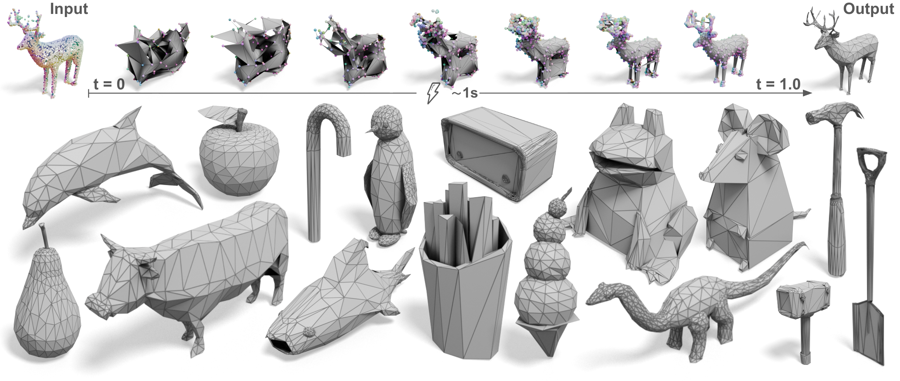

<div align="center">
<h2>MeshFlow: Efficient Artistic Mesh Generation with MeshVAE and Flow-based Diffusion Transformer (CVPR 2026 Highlight)</h2>

<a href="https://github.com/fairinternal/meshflow" target="_blank" rel="noopener noreferrer"></a>


<p>
  <span class="author"><a href="https://wyysf-98.github.io/">Weiyu Li</a><sup>1,2</sup></span>
  <span class="author"><a href="https://www.antoinetlc.com/">Antoine Toisoul</a><sup>1</sup></span>
  <span class="author"><a href="https://www.tmonnier.com/">Tom Monnier</a><sup>1</sup></span>
  <span class="author"><a href="https://rshapovalov.com/">Roman Shapovalov</a><sup>1</sup></span>
  <br>
  <span class="author"><a href="https://scholar.google.com/citations?user=9rFaJIUAAAAJ">Rakesh Ranjan</a><sup>1</sup></span>
  <span class="author"><a href="https://ece.hkust.edu.hk/pingtan">Ping Tan</a><sup>2</sup></span>
  <span class="author"><a href="https://www.robots.ox.ac.uk/~vedaldi/">Andrea Vedaldi</a><sup>1</sup></span>
</p>

**<sup>1</sup>[Meta AI](https://ai.facebook.com/research/)**; **<sup>2</sup>[HKUST](https://hkust.edu.hk/)**

</div>

<p align="center">
  
</p>

MeshFlow generates artist-like meshes in **~1 second** with **MeshVAE** + **flow-matching DiT**, using input geometry and an optional reference image.

## Pretrained models

Before running the code, download the MeshFlow checkpoint bundle and place it under `ckpt/meshflow/`:

```
ckpt/meshflow/
├── config.yaml
└── model.pth
```

You can also prepare the directory manually:

```bash
mkdir -p ckpt/meshflow
# download config.yaml and model.pth into ckpt/meshflow/
```

| Module | Role |
| :--- | :--- |
| **MeshFlowVAE** | Encodes mesh topology into continuous latents; decodes verts, normals, and adjacency |
| **MeshFlowDiT** | Flow matching on latents with voxel RoPE + optional image cross-attention |
| **DINOv3Encoder** | Visual tokens for optional reference-image conditioning |
| **MeshFlowPipeline** | End-to-end: surface sampling → flow matching → VAE decode |

### Image conditioning: DINOv3

If you use **reference-image conditioning** (`inference_dit.py --ref_image`, `pipeline.run(image=...)`, or the Gradio image upload), you also need to configure **DINOv3**. Mesh / point-cloud-only inference does not load DINOv3.

<details><summary><b>DINOv3 setup instructions</b></summary>

1. **Clone the official repo** ([facebookresearch/dinov3](https://github.com/facebookresearch/dinov3)) to the default `hub_dir`:

```bash
git clone https://github.com/facebookresearch/dinov3.git \
  ~/.cache/torch/hub/facebookresearch_dinov3_main
```

2. **Request and download backbone weights** following the [DINOv3 pretrained models guide](https://github.com/facebookresearch/dinov3#pretrained-models). Access is granted via [Meta's DINOv3 download page](https://ai.meta.com/resources/models-and-libraries/dinov3-downloads/); after approval you will receive download URLs by email. Use `wget` (not a web browser) to fetch the checkpoint matching your config (default: **`dinov3_vitl16`**).

3. **Optional:** point MeshFlow to local weights in `ckpt/meshflow/config.yaml` if the default Meta CDN download does not work in your environment:

```yaml
visual_condition:
  hub_model: dinov3_vitl16
  hub_dir: /root/.cache/torch/hub/facebookresearch_dinov3_main
  hub_weights: /path/to/dinov3_vitl16_pretrain_lvd1689m-8aa4cbdd.pth
  pretrained: true
  image_size: 512
```

`model.pth` does not bundle DINOv3 weights; the visual encoder backbone is loaded from the local DINOv3 hub checkout on first reference-image use.

</details>

## Quick Start

First, clone this repository and install the dependencies:

```bash
git clone https://github.com/fairinternal/meshflow.git
cd meshflow
pip install -r requirements.txt
```

Download the MeshFlow checkpoint into `ckpt/meshflow/` as described above.

Now, try the model with a few lines of code:

```python
from meshflow.pipelines import MeshFlowPipeline

pipeline = MeshFlowPipeline.from_pretrained(
    "ckpt/meshflow",
    device="cuda",
    dtype="float16",
)

mesh = pipeline.run(
    mesh="path/to/input.ply",       # mesh / point cloud for RoPE geometry condition
    image=None,                     # optional reference image (.png / .jpg / .webp)
    steps=24,
    guidance_scale=2.5,             # only effective when `image` is provided (CFG on visual cond)
    seed=42,
)
mesh.to_trimesh().export("output.glb")
```

<details><summary>Full abstract</summary>

Artist-created meshes remain the gold standard for 3D production, but recent learning-based generators often rely on autoregressive mesh tokenization, which is slow, hard to control, and sensitive to long sequences. MeshFlow addresses these limitations with a two-stage design tailored to **efficient artistic mesh generation**:

1. **MeshVAE** — A transformer VAE encodes mesh topology (vertices, normals, adjacency, and local geometric features) into **continuous latent tokens** and decodes them back to high-quality meshes.
2. **Flow-matching DiT** — A diffusion transformer performs **flow matching** on the VAE latents in parallel, conditioned on **3D RoPE** from voxelized surface points of an input mesh/point cloud and optional **DINOv3** visual tokens from a reference image.

By generating all latents jointly instead of predicting mesh elements one-by-one, MeshFlow achieves **fast generation** (about **1 second** per mesh on a single GPU) while preserving sharp, artist-friendly geometry. The model also supports **test-time scaling** of the vertex budget (2048–8192).

**Inputs**
- Geometry (RoPE): mesh (`.glb`, `.obj`, `.stl`, `.ply`) or point cloud (`.ply`, `.pcd`, `.xyz`, `.pts`, `.npy`, `.npz`)
- Reference image (optional): `.png`, `.jpg`, `.webp` (matched by filename stem when using folders)

</details>

## Interactive Demo

Launch the Gradio demo:

```bash
python gradio_app.py \
  --model_path ckpt/meshflow \
  --gpu 0 \
  --precision float16 \
  --num_verts 4096
```

Upload a mesh or point cloud for RoPE surface sampling, optionally add a reference image, and generate a new mesh in the browser. `torch.compile` is enabled by default on CUDA (`--no-compile` to disable). When the model config sets `denoiser_model.use_proj_cond_on_temb: true`, use the **num_verts** slider in Advanced options for test-time scaling (1024–8192).

## Inference

### VAE reconstruction

```bash
python inference_vae.py \
  --model_path ckpt/meshflow \
  --input <mesh_file_or_dir> \
  --output outputs/meshflow_vae/run1
```

Outputs: `inputs_meshes/` (`.ply`), `vae_recon/` (`.ply`).

### DiT generation

```bash
python inference_dit.py \
  --model_path ckpt/meshflow \
  --input <mesh_file_or_dir> \
  --ref_image <image_file_or_dir> \
  --output outputs/meshflow_dit/run1 \
  --steps 24 \
  --compile \
  --guidance_scale 2.5  # only when --ref_image is provided
```

`--ref_image` is optional — if omitted, a zero visual condition is used. When using a reference image, configure DINOv3 as described in [Pretrained models](#image-conditioning-dinov3).

Outputs: `inputs_meshes/`, `inputs_images/` (when `--ref_image` is set), `generated_meshes/` (`.glb`).

| Flag | Description |
|------|-------------|
| `--model_path` | Directory with `config.yaml` + `model.pth` |
| `--steps` | Sampling steps (default: from config) |
| `--guidance_scale` | CFG on visual cond; only effective when `--ref_image` is set (default: from config) |
| `--dtype` | Autocast dtype (default: `float16`) |
| `--num_verts` | Test-time vertex budget override; only when `denoiser_model.use_proj_cond_on_temb` is enabled |
| `--num_verts_max` | Normalizer for `proj_cond_on_temb`; only when `use_proj_cond_on_temb` is enabled |
| `--compile` | `torch.compile` on CUDA for faster inference (recommended; omit to disable) |
| `--seed` | Random seed |

## Evaluation

Chamfer and Hausdorff distances between GT and reconstructed meshes:

```bash
python evaluate.py \
  --gt_path outputs/meshflow_vae/run1/inputs_meshes \
  --pred_path outputs/meshflow_vae/run1/vae_recon \
  --output_path outputs/meshflow_vae/run1/eval_results.txt
```

## Notes

- Input meshes should respect the configured vertex budget (4096 by default). Test-time scaling via `--num_verts` is only available when `denoiser_model.use_proj_cond_on_temb` is enabled in the model config.
- Optional RMBG matting is in `meshflow/pipelines/utils.py`; enable with `MeshFlowPipeline(use_rmbg=True)`.

## BibTeX

```bibtex
@inproceedings{li2026meshflow,
  title={MeshFlow: Efficient Artistic Mesh Generation via MeshVAE and Flow-based Diffusion Transformer},
  author={Li, Weiyu and Toisoul, Antoine and Monnier, Tom and Shapovalov, Roman and Ranjan, Rakesh and Tan, Ping and Vedaldi, Andrea},
  booktitle={Proceedings of the IEEE/CVF Conference on Computer Vision and Pattern Recognition (CVPR)},
  year={2026},
  note={Highlight}
}
```
